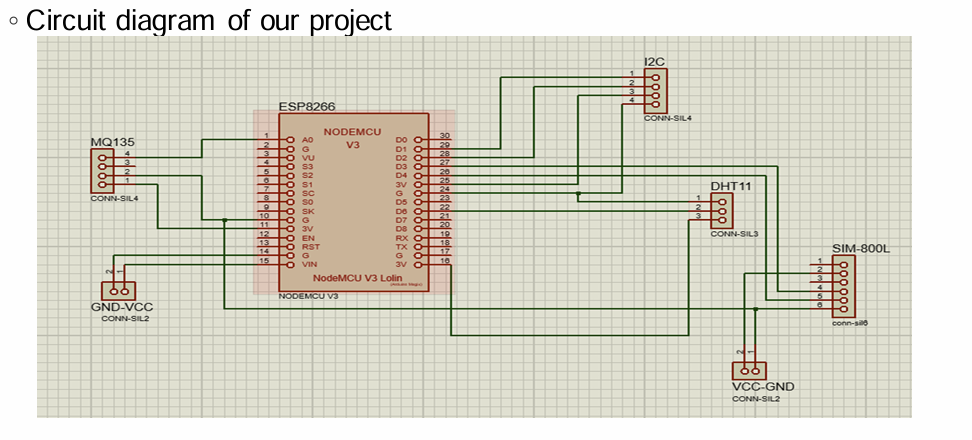

# IoT-Based Environment Monitor System

This project is an IoT-based environment monitoring system designed to provide real-time readings of **air quality, temperature, and humidity**. It was developed as a final project for **EEE 416 – Microprocessor and Embedded Systems Laboratory** at the **Bangladesh University of Engineering and Technology (BUET)**.

---

## Key Features

- **Real-time Monitoring:**  
  Continuously tracks environmental parameters including temperature, humidity, and various gases (ammonia, sulfide, smoke, CO₂).

- **GSM Integration:**  
  Automatically sends warning SMS alerts to a user’s phone when environmental parameters exceed preset safety thresholds.

- **Solar Powered:**  
  Fully portable system powered by renewable solar energy with battery backup for nighttime or indoor operation.

- **Cloud Connectivity:**  
  Real-time data upload to the **ThingSpeak** platform for remote monitoring and historical data logging.

---

## Hardware Components

### Core Components

- **Microcontroller:** NodeMCU ESP8266  
- **Sensor (DHT11):** Temperature and humidity measurement  
- **MQ135:** Gas sensor for air quality estimation  
- **Communication Module:** SIM800L GSM  
- **Display:** LCD with I2C adapter  

### Solar Power System

- 6V solar panels  
- TP4056 battery charger  
- MT3608 boost converter  
- Rechargeable battery  

---

## Data Access

The system provides multiple methods for accessing environmental data:

- **Local Display:**  
  Real-time sensor data shown on the mounted LCD screen.

- **Web Dashboard:**  
  Live charts and historical records available on the ThingSpeak platform.

- **Mobile App:**  
  Remote access using the ThingView mobile application.

- **SMS Alerts:**  
  Direct text messages sent during threshold breaches.

---

## Project Impact

This system is designed for deployment in **homes, schools, hospitals, and workplaces** to help identify activities affecting air quality and promote a healthier environment.  
For highly polluted urban areas such as **Dhaka**, it serves as an effective awareness and early-warning tool for environmental conditions.

---

## Project Status

✅ **Completed** — Baseline implementation  

🔧 **Open for enhancements and upgrades**

---

## Contributors

- Shafim Bin Hassan (1706172)  
- Mostakin Ahmed Rafat (1706173)  
- Subah Karnine (1706174)  
- Farhan Hamid (1706175)  
- **Joy Saha (1706189)**  

Department of Electrical & Electronic Engineering  
Bangladesh University of Engineering and Technology (BUET)

---

## License

This project is for **academic and educational purposes only**.
