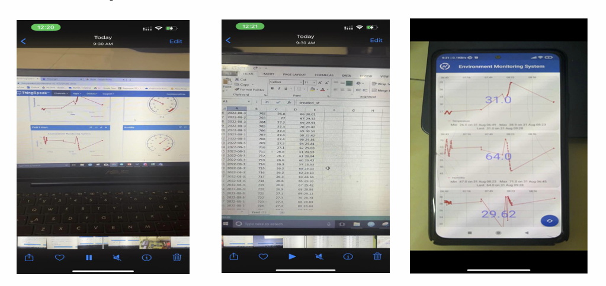

# IoT-Based-Environment-Monitor-System

This project is an IoT-based environment monitoring system designed to provide real-time readings of air quality, temperature, and humidity. It was developed as a final project for the EEE 416 – Microprocessor and Embedded Systems Laboratory course at the Bangladesh University of Engineering and Technology.

###### **Key Features**

* **Real-time Monitoring:** Continuously tracks environmental parameters including temperature, humidity, and various gases (ammonia, sulfide, smoke, CO2).
* **GSM Integration:** Automatically sends warning SMS alerts to a user's phone when environmental parameters exceed preset safety thresholds.
* **Solar Powered:** The system is entirely portable and run by renewable solar energy with a battery backup for nighttime or indoor use.
* **Cloud Connectivity:** Data is uploaded in real-time to the ThingSpeak platform for remote monitoring and historical data logging.

###### **Hardware Components**

Microcontroller: NodeMCU ESP8266 

Sensor-DHT11: Temperature and humidity sensor 

MQ135: Gas sensor for air quality estimation 

Communication: SIM800L GSM module 

Display: LCD display with I2C adapter 

Solar Power System

6V Solar Panels 

TP4056 Battery Charger 

MT3608 Boost Converter 

Rechargeable Battery 

###### **Data Access**

* The system provides three primary methods for accessing environmental data:
* Local Display: Real-time data is shown on the mounted LCD screen.
* Web Dashboard: Users can view live charts and historical records on the ThingSpeak website.
* Mobile App: The ThingView app can be used to access the most recent data remotely.
* SMS Alerts: Direct text messages are sent during threshold breaches.

###### **Project Impact**

This monitor is designed for use in homes, schools, hospitals, and workspaces to help identify activities affecting air quality and promote a healthier environment. For highly polluted urban areas like Dhaka, it serves as a "wake up call" regarding surrounding pollution levels.

###### **Project Status**

✅ Completed — Baseline implementation

🔧 Open for enhancements and upgrades

###### **Contributors**

Shafim Bin Hassan (1706172), Mostakin Ahmed Rafat (1706173), Subah Karnine (1706174), Farhan Hamid (1706175), Joy Saha (1706189)

Department of Electrical \& Electronic Engineering, Bangladesh University of Engineering and Technology (BUET)

###### **License**

This project is for academic and educational purposes.
